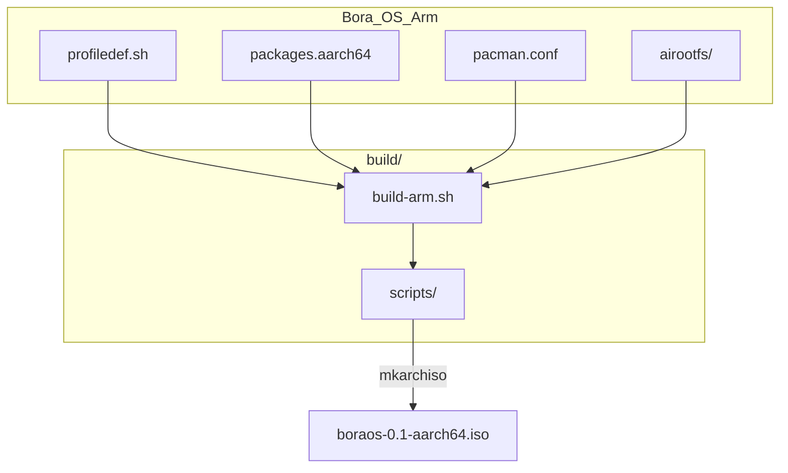

# BoraOS ARM64 Profile

BoraOS ARM64 (aarch64) live ISO profile for Generic ARM UEFI devices.

## Overview

This profile creates a bootable BoraOS live ISO for ARM64 architecture, featuring:

- **Hyprland** Wayland compositor
- **SDDM** display manager with auto-login
- **PipeWire** audio system
- **NetworkManager** for connectivity
- Pre-configured desktop environment

## Target Platforms

- **UTM** on Apple Silicon Mac (primary test environment)
- **QEMU** aarch64 virtual machines
- **Generic ARM UEFI** devices

> **Note**: This is a Generic ARM UEFI ISO, not SBC-specific. Raspberry Pi and other SBCs may require additional configuration.

## Quick Build

```bash
# From this directory
sudo ./build/build-arm.sh
```

**Requirement**: Must be run on an aarch64 system (e.g., UTM Arch Linux ARM)

## Build Architecture



## Directory Structure

```
Bora_OS_Arm/
├── profiledef.sh          # Profile definition
├── packages.aarch64       # Package list
├── pacman.conf            # Arch Linux ARM pacman config
├── grub/                  # GRUB config (optional)
├── efiboot/               # systemd-boot config (primary)
├── airootfs/              # Root filesystem overlay
│   ├── etc/               # System configuration
│   ├── root/              # Root user config
│   └── usr/               # User-space files
└── build/                 # Build system
    ├── build-arm.sh       # Master build script
    ├── ARM_BUILD_GUIDE.md # Full documentation
    └── scripts/           # Build helper scripts
```

## Key Files

| File | Purpose |
|------|---------|
| `profiledef.sh` | ISO name, version, boot modes |
| `packages.aarch64` | ARM-compatible packages |
| `pacman.conf` | ALARM mirror configuration |
| `efiboot/loader/` | systemd-boot configuration |

## Build Output

```
build/out/
├── boraos-0.1-aarch64.iso
└── SHA256SUMS
```

## Documentation

See [ARM_BUILD_GUIDE.md](build/ARM_BUILD_GUIDE.md) for complete build instructions.
