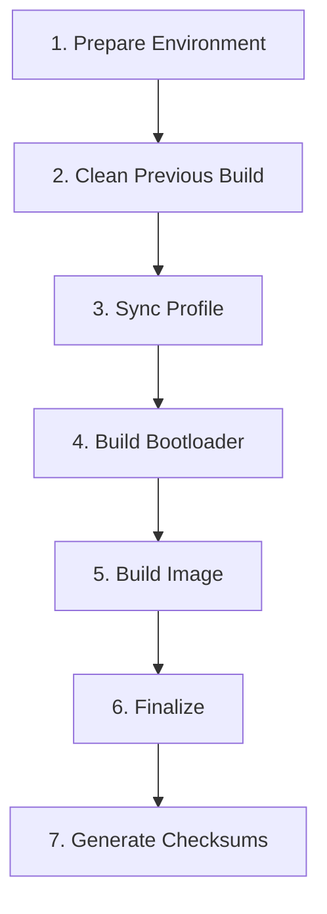

# BoraOS x86_64 Build System - Complete Guide

## Overview

This document provides comprehensive information about the BoraOS x86_64 build system, including architecture, processes, and customization options.

## Build Architecture

### Directory Structure

```
Bora_OS_x86/
├── build/
│   ├── build-x86.sh              # Main orchestrator
│   ├── environment.sh            # Reproducible build environment
│   ├── logs/                     # Build logs (auto-created)
│   ├── out/                      # ISO output (auto-created)
│   └── scripts/
│       ├── prepare_environment_x86.sh    # System checks
│       ├── clean_previous_build.sh       # Cleanup
│       ├── sync_profile_x86.sh           # Profile sync
│       ├── build_bootloader_x86.sh       # Bootloader verify
│       ├── build_image_x86.sh            # ISO creation
│       ├── finalize_x86.sh               # Rename/finalize
│       └── generate_checksums.sh         # SHA256 generation
├── airootfs/                     # Root filesystem overlay
├── efiboot/                      # systemd-boot config
├── syslinux/                     # BIOS boot config
├── grub/                         # GRUB UEFI config
├── profiledef.sh                 # ArchISO profile
├── pacman.conf                   # Repository config
├── packages.x86_64               # Package list (129 packages)
├── README.md                     # User guide
└── SECURITY.md                   # Security documentation
```

### Build Pipeline

The build process follows 7 sequential steps:



## Build Steps Explained

### Step 1: Prepare Environment
**Script**: `prepare_environment_x86.sh`

**Purpose**: Verify system readiness

**Checks**:
- Architecture (must be x86_64)
- Required tools (pacman, mkarchiso, mkinitcpio, etc.)
- Disk space (minimum 10GB)
- RAM (minimum 4GB recommended)
- Directory structure
- Profile files

**Output**: System validation report

### Step 2: Clean Previous Build
**Script**: `clean_previous_build.sh`

**Purpose**: Remove old build artifacts

**Actions**:
- Removes `build/work/` directory
- Cleans `build/out/` if requested
- Preserves logs with timestamps

### Step 3: Sync Profile
**Script**: `sync_profile_x86.sh`

**Purpose**: Copy profile to work directory

**Copies**:
- `profiledef.sh` → Profile definition
- `pacman.conf` → Repository configuration
- `packages.x86_64` → Package list
- `airootfs/` → Root filesystem overlay
- `grub/` → GRUB configuration
- `syslinux/` → Syslinux configuration
- `efiboot/` → systemd-boot configuration

**Deterministic**: Sets fixed timestamps for reproducibility

### Step 4: Build Bootloader
**Script**: `build_bootloader_x86.sh`

**Purpose**: Verify bootloader components

**Supports**:
1. **GRUB** (UEFI)
   - Verifies `grub-mkimage`
   - Checks for x86_64-efi modules
   
2. **Syslinux** (BIOS)
   - Verifies `syslinux` package
   - Checks configuration files

3. **systemd-boot** (UEFI)
   - Verifies `systemd` package
   - Checks loader configuration

### Step 5: Build Image
**Script**: `build_image_x86.sh`

**Purpose**: Create ISO using mkarchiso

**Process**:
```bash
mkarchiso -v -w work/ -o out/ work/profile/
```

**Features**:
- Reproducible builds (SOURCE_DATE_EPOCH)
- Full logging to `build/logs/mkarchiso.log`
- Error reporting

**Output**: `build/out/boraos-*.iso`

### Step 6: Finalize
**Script**: `finalize_x86.sh`

**Purpose**: Standardize ISO naming

**Actions**:
- Finds generated ISO
- Renames to: `boraos-0.1-x86_64.iso`
- Reports file size

### Step 7: Generate Checksums
**Script**: `generate_checksums.sh`

**Purpose**: Create verification hashes

**Generates**:
- `SHA256SUMS` file
- Individual `.sha256` files for each ISO

## Customization

### Package List

**File**: `packages.x86_64`

**Format**: One package per line

**Categories**:
```ini
# Base system (13 packages)
base
base-devel
linux
...

# Desktop Environment (11 packages)
hyprland
xdg-desktop-portal-hyprland
...

# Applications (7 packages)
alacritty
firefox
...
```

**Adding Packages**:
1. Edit `packages.x86_64`
2. Add package name (must be in official repos)
3. Rebuild ISO

**Package Sources**:
- `core` repository
- `extra` repository
- NO AUR packages (not supported in standard builds)

### Boot Configuration

#### GRUB (UEFI)
**File**: `grub/grub.cfg`

**Boot Options**:
- Default boot
- Safe mode (nomodeset)
- Accessibility
- UEFI Shell
- Firmware settings

**Customization**:
```bash
# Edit timeout
set timeout=30

# Add custom entry
menuentry "Custom Option" {
    linux /arch/boot/x86_64/vmlinuz-linux ...
    initrd /arch/boot/x86_64/initramfs-linux.img
}
```

#### Syslinux (BIOS)
**File**: `syslinux/syslinux.cfg`

**Entry Format**:
```ini
LABEL boraos
    MENU LABEL BoraOS x86_64
    LINUX /%INSTALL_DIR%/boot/x86_64/vmlinuz-linux
    INITRD /%INSTALL_DIR%/boot/x86_64/initramfs-linux.img
    APPEND archisobasedir=%INSTALL_DIR% archisolabel=%ARCHISO_LABEL%
```

#### systemd-boot (UEFI)
**File**: `efiboot/loader/loader.conf`

**Configuration**:
```ini
timeout 3
default 01-archiso-x86_64-linux.conf
```

### Root Filesystem Overlay

**Directory**: `airootfs/`

**Purpose**: Customize live environment

**Common Customizations**:

1. **User Configuration**
   - `/etc/passwd` - User accounts
   - `/etc/shadow` - Passwords
   - `/etc/group` - Group memberships

2. **System Services**
   - `/etc/systemd/system/` - Service links
   - Enable: `ln -s /usr/lib/systemd/system/service.service`

3. **Desktop Configuration**
   - `/root/.config/hypr/` - Hyprland config
   - `/root/.config/waybar/` - Waybar config
   - `/root/.config/alacritty/` - Alacritty config

4. **System Settings**
   - `/etc/locale.conf` - Locale
   - `/etc/vconsole.conf` - Console
   - `/etc/sudoers.d/` - Sudo permissions

**Example - Add Custom Script**:
```bash
# Create script
cat > airootfs/usr/local/bin/myscript.sh << 'EOF'
#!/bin/bash
echo "Hello from BoraOS!"
EOF

# Make executable
chmod +x airootfs/usr/local/bin/myscript.sh
```

## Advanced Topics

### Reproducible Builds

**File**: `build/environment.sh`

**Key Variables**:
```bash
SOURCE_DATE_EPOCH="1701388800"  # Fixed timestamp
BORAOS_VERSION="0.1"
BORAOS_ARCH="x86_64"
ISO_LABEL="BORAOS_01"
```

**Benefits**:
- Bit-for-bit identical ISOs
- Verifiable builds
- Security auditing

### Build Modes

**Default**: ISO only
```bash
sudo ./build/build-x86.sh
```

**Bootstrap** (future):
```bash
sudo ./build/build-x86.sh --bootstrap
```

**Network Boot** (future):
```bash
sudo ./build/build-x86.sh --netboot
```

### Resource Requirements

| Component | Minimum | Recommended |
|-----------|---------|-------------|
| CPU | 2 cores | 4+ cores |
| RAM | 4GB | 8GB+ |
| Disk Space | 10GB free | 20GB+ free |
| Network | Required | Fast connection |
| Build Time | ~15 min | ~10 min |

### Parallel Builds

**Current**: Sequential build steps

**Future**: Parallel package downloads
```bash
# In pacman.conf
ParallelDownloads = 10
```

## Troubleshooting

See [X86_BUILD_GUIDE.md](X86_BUILD_GUIDE.md) for detailed troubleshooting.

### Quick Fixes

**"Tool not found"**:
```bash
sudo pacman -S archiso
```

**"Insufficient space"**:
```bash
# Clean package cache
sudo pacman -Sc

# Check space
df -h
```

**"Package not found"**:
- Verify package name in Arch repos
- Update package list: `packages.x86_64`
- No AUR packages allowed

## Build Logs

**Location**: `build/logs/`

**Files**:
- `mkarchiso.log` - Full build log
- `prepare.log` - Environment check
- `sync.log` - Profile sync
- `build_[timestamp].log` - Complete build

## Output Files

**Location**: `build/out/`

**Files**:
```
boraos-0.1-x86_64.iso          # Bootable ISO
boraos-0.1-x86_64.iso.sha256   # Checksum
SHA256SUMS                      # All checksums
```

**Verification**:
```bash
sha256sum -c boraos-0.1-x86_64.iso.sha256
```

## Development

### Testing Changes

1. Edit files in `Bora_OS_x86/`
2. Run build: `sudo ./build/build-x86.sh`
3. Test in VM: `qemu-system-x86_64 -cdrom out/*.iso -m 4096`

### Contributing

1. Test changes thoroughly
2. Update documentation
3. Follow existing patterns
4. Keep builds reproducible

---

**Last Updated**: 2025-12-04  
**Version**: 0.1  
**Architecture**: x86_64
